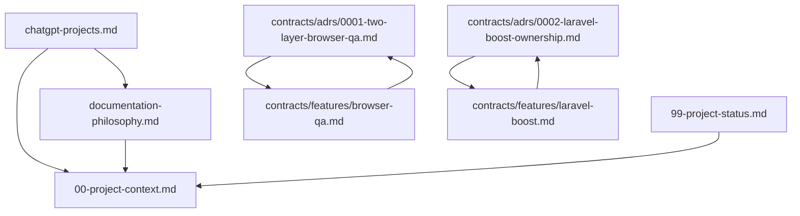

# Documentation Index

This file is the dependency graph and contract registry for the AI Platform
documentation.

## Overview

The AI Platform repository documents its own standards under `docs/`. Individual
development projects maintain their own `docs/` directory using the same
contract model and templates from `templates/docs/`.

## Contract Registry

| Contract | Type | Status | Source of Truth For |
| --- | --- | --- | --- |
| `00-project-context.md` | foundational | active | AI Platform summary for ChatGPT and agents |
| `99-project-status.md` | status | active | Implementation status and validation |
| `documentation-philosophy.md` | foundational | active | Documentation contract standard |
| `chatgpt-projects.md` | foundational | active | ChatGPT Projects export workflow |
| `contracts/adrs/0001-two-layer-browser-qa.md` | adr | accepted | Decision to use Mode A/B browser QA |
| `contracts/adrs/0002-laravel-boost-ownership.md` | adr | accepted | Decision that Boost is project-native |
| `contracts/features/browser-qa.md` | feature | active | Browser QA policy, opt-in agent invocation, applicability, isolation |
| `contracts/features/laravel-boost.md` | feature | active | Boost capability, detection, bootstrap/doctor |

## Dependency Graph



## Loading Guide

| Task type | Start with |
| --- | --- |
| ChatGPT / platform overview | `00-project-context.md` |
| Documentation standard | `documentation-philosophy.md` |
| ChatGPT export setup | `chatgpt-projects.md` |
| New or existing project bootstrap | `scripts/bootstrap-project.sh`, `.cursor/rules/50-workflows.mdc`, `core/prompts/existing-project-bootstrap.md` |
| Browser QA / Playwright | `contracts/features/browser-qa.md` |
| Laravel Boost / MCP | `contracts/features/laravel-boost.md`, `mcp/README.md` |
| Laravel web app profile | `core/project-profiles/laravel-webapp.md` |
| Roots/Radicle/Sage profile | `core/project-profiles/roots-radicle.md` |

## ChatGPT Export

```bash
scripts/export-chatgpt-context.sh
```

Produces `.build/chatgpt-context.zip` with documentation, Cursor rules, agent
skills, and project AI metadata.
