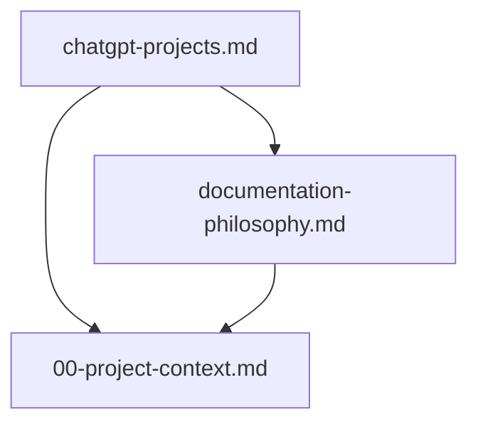

# Documentation Index

This file is the dependency graph and contract registry for the AI Platform
documentation.

## Overview

The AI Platform repository documents its own standards under `docs/`. Individual
development projects maintain their own `docs/` directory using the same
contract model and templates from `templates/docs/`.

## Contract Registry

| Contract | Type | Status | Source of Truth For |
| --- | --- | --- | --- |
| `00-project-context.md` | foundational | active | AI Platform summary for ChatGPT and agents |
| `documentation-philosophy.md` | foundational | active | Documentation contract standard |
| `chatgpt-projects.md` | foundational | active | ChatGPT Projects export workflow |

## Dependency Graph



## Loading Guide

| Task type | Start with |
| --- | --- |
| ChatGPT / platform overview | `00-project-context.md` |
| Documentation standard | `documentation-philosophy.md` |
| ChatGPT export setup | `chatgpt-projects.md` |
| New project bootstrap | `scripts/bootstrap-project.sh`, `templates/docs/` |

## ChatGPT Export

```bash
scripts/export-chatgpt-context.sh
```

Produces `.build/chatgpt-context.zip` with documentation, Cursor rules, agent
skills, and project AI metadata.
