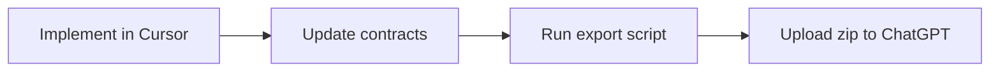

# ChatGPT Projects

This guide explains how to export project AI context for ChatGPT Projects and
keep it synchronized with the repository.

## Purpose

ChatGPT Projects accept uploaded files as persistent context. The AI Platform
provides a single export command that bundles everything ChatGPT needs to
understand the project — documentation, Cursor rules, agent skills, and AI
metadata — without source code, dependencies, tests, or build artifacts.

Cursor agents continue to use **selective loading** from the contract graph
via `docs/README.md`.

## Workflow



### 1. Maintain contracts in the repository

All documentation lives under `docs/` as contracts with metadata frontmatter.
`docs/README.md` is the dependency graph and contract registry.

### 2. Keep project context current

`docs/00-project-context.md` is the ChatGPT entry point — a concise summary
of what the project is, its stack, constraints, and where to find contracts.

Update it when stack, purpose, or constraints change materially.

### 3. Export context

From the **project** root (after bootstrap this is a symlink):

```bash
scripts/export-chatgpt-context.sh
```

If that symlink is missing, run the clone copy **from the same project
root**:

```bash
/path/to/ai-platform/scripts/export-chatgpt-context.sh
```

The script copies project AI context into `.build/chatgpt-context/` and
produces `.build/chatgpt-context.zip`.

### 4. Upload to ChatGPT

Upload `.build/chatgpt-context.zip` to your ChatGPT Project. Re-export and
re-upload when documentation, Cursor rules, agent skills, or AI metadata
change.

## What Gets Exported

| Included | Excluded |
| --- | --- |
| `docs/` (all contracts and ADRs) | Source code (`app/`, `src/`, etc.) |
| `.cursor/rules/` | `bootstrap/`, `config/`, `database/` |
| `.agents/` (if present) | `public/`, `resources/`, `routes/` |
| `skills-lock.json` (if present) | `tests/`, `vendor/`, `node_modules/` |
| Project AI docs (`AGENTS.md`, etc.) | `storage/`, `.git/`, build artifacts |

## Bootstrap

New projects bootstrapped via `scripts/bootstrap-project.sh` receive:

- Documentation contract templates under `docs/`
- Symlinks to `scripts/export-chatgpt-context.sh` and `scripts/doctor.sh`

Existing projects keep their docs. Bootstrap adds only missing drafts and
prints a capability diagnosis (Laravel Boost, Playwright, Roots stack)
without installing packages. It does not analyze or adopt the project
and does not install user-global MCP servers.
After bootstrap, run Project Adoption in a fresh agent session:
`core/prompts/project-adoption.md`. First-time clone steps are in the
repository `README.md`.

## .gitignore

Add to the project `.gitignore`:

```
.build/
```

Export artifacts are local build output and should not be committed.
