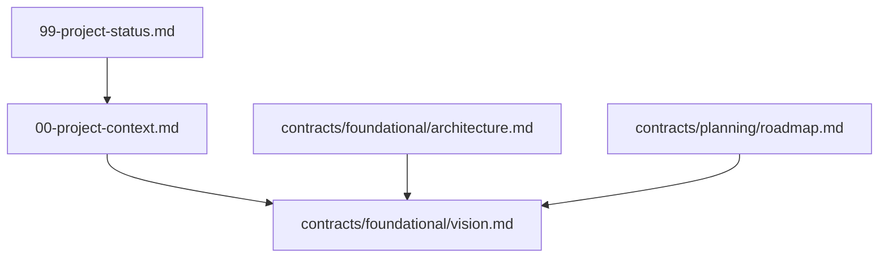

# Documentation Index

This file is the entry point for all project documentation. AI agents and
contributors start here before loading individual contracts.

`docs/README.md` is the **dependency graph** and **contract registry**.

## Overview

<!-- Describe how documentation is organized in this project. -->

This project uses contract-based documentation. Each contract owns one concern
and declares its dependencies in frontmatter.

## Contract Registry

| Contract | Type | Status | Source of Truth For |
| --- | --- | --- | --- |
| `00-project-context.md` | foundational | active | Project summary for ChatGPT and agents |
| `99-project-status.md` | status | active | Phase progress and validation (not architectural authority) |
| `contracts/foundational/vision.md` | foundational | active | Product purpose, goals, constraints |
| `contracts/foundational/architecture.md` | foundational | active | System structure, major components |
| `contracts/planning/roadmap.md` | planning | active | Planned work (not implementation authority) |

Add rows as contracts are created. Set `Type` to `foundational` for stable,
high-level context. Set `Type` to `adr` for architecture decision records.
Remove or mark deprecated contracts when retired.

## Dependency Graph



Update this graph when contract dependencies change.

## Loading Guide

| Task type | Start with |
| --- | --- |
| ChatGPT / high-level context | `00-project-context.md` → foundational contracts |
| New feature | `docs/README.md` → relevant feature contract → `depends_on` chain |
| Architecture change | `contracts/foundational/architecture.md` → affected engine contracts |
| Bug fix | Feature or engine contract for affected area |
| Planning | `contracts/planning/roadmap.md` only (not authoritative for implementation) |

## ChatGPT Export

Run from the project root:

```bash
scripts/export-chatgpt-context.sh
```

This exports documentation, Cursor rules, agent skills, and project AI
metadata to `.build/chatgpt-context.zip`.
